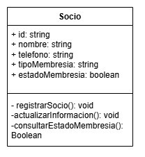

### Abstracción

La abstracción simplifica la realidad modelando clases a partir de objetos del mundo real, considerando solo las características esenciales. Se centra en "qué hace" un objeto más que en "cómo lo hace".


- [Diagrama de la clase](https://drive.google.com/file/d/1l_yZYCP1imGQmKD5uv7kyAzmP1AS-NeK/view?usp=sharing)

Aplicado al sistema:  La clase Socio abstrae a un socio del gimnasio con propiedades como nombre, telefono, tipoMembresía, etc. Se omiten detalles como su historial de entrenamiento o preferencias.

```java
class Socio {
  String id;
  String nombre;
  String telefono;
  String tipoMembresia;
  Boolean estadoMembresia;


  public void registrarSocio() {
    // Lógica para registrar un socio
  }

  public void actualizarInformacion() {
    // Lógica para actualizar informacion
  }

  public void consultarEstadoMembresia(){
    // Lógica para consultar el estado de la membresia
  }
}
```
