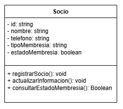

### Encapsulamiento

El encapsulamiento protege los datos del sistema y controla como se accede/modifica. Sirve para evitar errores y proteger la lógica del sistema.


- [Diagrama de la clase](https://drive.google.com/file/d/1Vhn3i1puu0eL2azBnGFur9j5DSOA5wI-/view?usp=sharing)

Aplicado al sistema: La clase Membresia encapsula el tipo y precio de la membresía. Se accede a estos datos mediante métodos como getTipo() y getPrecio(), pero no se modifican directamente desde fuera de la clase.

```java
class Membresia {
  private String tipo;
  private Date fechaVencimiento;
  private Boolean activo;
  private String socioId;

  public String getTipo() {
    return tipo;
  }

  public Date fechaVencimiento() {
    return fechaVencimiento;
  }

    public Boolean activo() {
    return activo;
  }
}
```