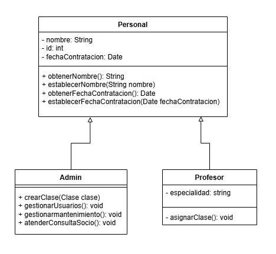

### Herencia 

La herencia permite crear nuevas clases a partir de clases existentes, heredando sus propiedades y métodos, fomentando la reutilización de código.


- [Diagrama de la clase](https://drive.google.com/file/d/1194jkgcd2cKm2iyOWwGfRxAtWP-Jy2Jg/view?usp=sharing)

Aplicado al sistema: La clase Admin hereda de la clase Socio, añadiendo funcionalidades específicas para administradores.

```java
class Admin extends Personal {
  public void crearClase(Clase clase) {
    // Lógica para crear una clase
  }

  public void registrarSocio(Socio socio) {
    // Lógica para registrar un socio
  }
}
```