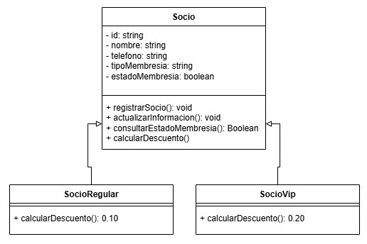

### Polimorfismo

El polimorfismo permite que objetos de diferentes clases respondan de manera distinta al mismo mensaje. Un método puede tener diferentes implementaciones según la clase.


- [Diagrama de la clase](https://drive.google.com/file/d/1rhHrce388fOjK8kFT6xah4zGbpSxqsy6/view?usp=sharing)

Aplicado al sistema: En la clase Socio se podria agregar un método calcularDescuento(). Este método se implementaría de forma diferente en subclases como SocioVIP o SocioRegular, para aplicar descuentos específicos.

```java
// Clase base Socio
class Socio {
    public double calcularDescuento() {
        // Implementación por defecto: sin descuento
        return 0;
    }
}

// Subclase SocioVIP
class SocioVIP extends Socio {
    @Override
    public double calcularDescuento() {
        // Descuento del 20% para socios VIP
        return 0.20;
    }
}

// Subclase SocioRegular
class SocioRegular extends Socio {
    @Override
    public double calcularDescuento() {
        // Descuento del 10% para socios regulares
        return 0.10;
    }
}
```